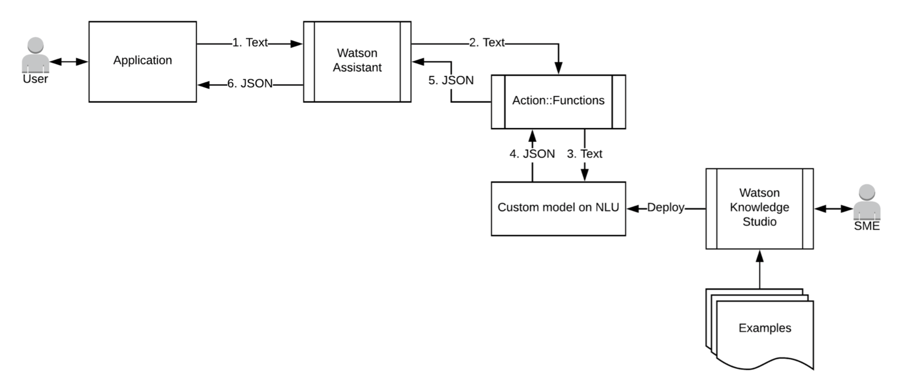
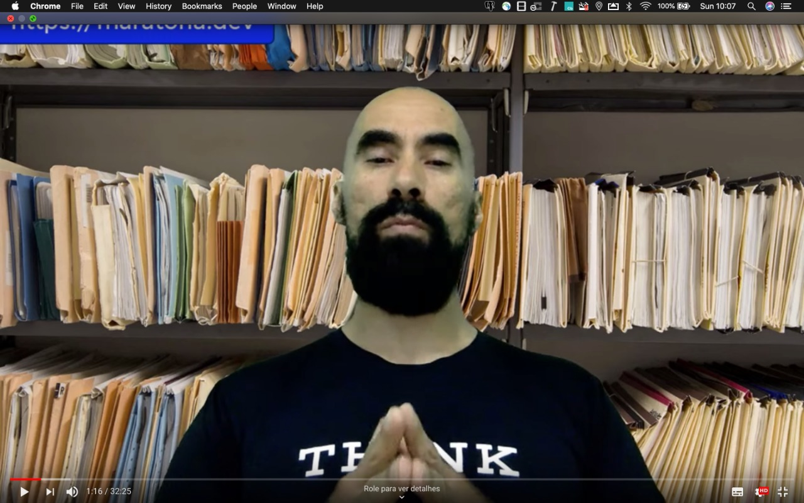
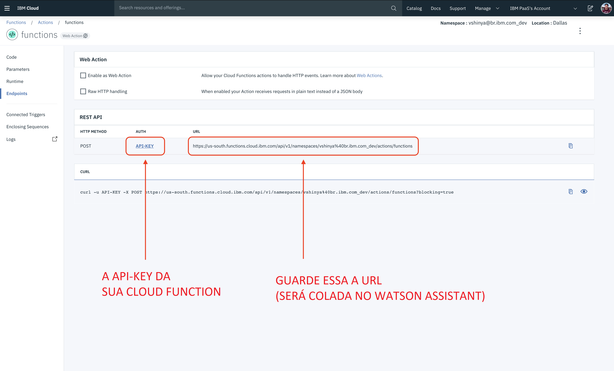
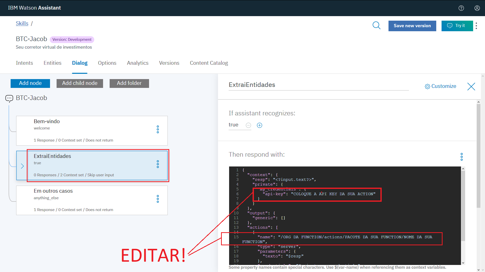

[](https://cloud.ibm.com)
[](https://developer.ibm.com/node/)
[](https://ibm.biz/convite-slack)

# Desafio 07 | Banco Original

* [1. Introdução](#1-introdução)
* [2. Desafio](#2-desafio)
* [3. Avaliação](#3-avaliação)
* [4. Pré-requisitos](#4-pré-requisitos)
* [5. Instanciando o Watson Natural Language Understanding](#5-instanciando-o-watson-natural-language-understanding)
    * [5.1. Credenciais do Watson Natural Language Understanding](#5-1-credenciais-do-natural-language-understanding)
* [6. Treinamento do classificador de anotações](#6-treinamento-do-classificador-de-anotações)
* [7. Configurando a IBM Cloud Function](#7-configurando-a-ibm-cloud-function)
* [8. Instanciando o Watson Assistant](#8-instanciando-o-watson-assistant)
    * [8.1. Importando a Skill do Banqueiro](#8-1-importando-a-skill-do-banqueiro)
    * [8.2. Integrando o Watson Assistant com uma Cloud Function](#8-1-integrando-o-watson-assistant-com-uma-cloud-function)
* [9. Aplicação Node.js na IBM Cloud](#9-aplicação-node.js-na-IBM-Cloud)
    * [9.1. Veja como configurar o IBM Continuous Delivery](#9-1-veja-como-configurar-o-ibm-continuous-delivery)
    * [9.2. Credenciais na aplicação](#9-2-credenciais-na-aplicação)
* [10. Submissão](#10-submissão)

## Para te ajudar

* [Material de Apoio](#material-de-apoio)
* [Troubleshooting](#troubleshooting)
* [Dúvidas](#dúvidas)
* [License](#license)

## 1. Introdução

O Banco Original, primeiro banco no Brasil a proporcionar abertura de conta corrente 100% digital, tem a inovação em seu DNA. Por isso, está em sempre em busca de melhorar a experiência de seus clientes, ao oferecer os melhores serviços, de forma simples, sem burocracia e seguro, por meio da tecnologia. Para auxiliar os clientes nas operações com fundos de investimentos, o Original procura uma solução que utilize Inteligência Artificial e que, pelo entendimento de linguagem natural, consiga identificar tipos de operação, de valor, cliente e fundo de investimento. O banco, uma vez com estas informações, será muito mais preciso na resposta para direcionar e processar a transação do cliente.

## 2. Desafio

A proposta deste desafio é criar um sistema de investimentos em fundos mais sofisticado e eficaz do que um assistente criado somente utilizando `Watson Assistant`, levando em conta também o sentimento do usuário em contato com o banco para direcionar melhor o atendimento, de maneira que o banco não perca a oportunidade do contato. No geral o participante deverá fazer com que o participante integre um modelo de anotações criado com o `Watson Knowledge Studio` ao chatbot criado com `Watson Assistant`.

A solução criada pelo participante deverá ser então um sistema intermediador que será capaz de capturar tanto a intenção e sentimento do usuário quanto entidades textuais. As entidades textuais consideradas são: o nome do usuário, fundo, valor e tipo de operação. Devido a grande variação de combinações de entidades, uma solução mais robusta é integrar o assistente virtual com capabilidades de entendimento de linguagem natural (*Natural Language Understanding*). Um modelo de anotação capaz de identificar as entidades será customizado no `Watson Knowledge Studio`, que utiliza aprendizado de máquina para criar um classificador capaz de identificar entidades textuais em texto não-estruturado. O modelo criado no `Watson Knowledge Studio` será carregado no `Watson Natural Language Understanding`, o qual será integrado ao `Watson Assistant` através de uma *serverless* `IBM Cloud Function`. A arquitetura da solução é esquematizada na figura abaixo.

<div align="center">
    
</div>

O Watson Assistant será então utilizado para interfacear um cliente de um banco com um sistema capaz de realizar operações financeiras, como investimento em fundos. Para realizar as operações desejadas pelos clientes de maneira correta, o `Watson Assistant` (WA) deverá ser capaz de identificar certas entidades nas entradas de texto. Para que isso seja possível, um modelo de anotação deverá ser criado pelo participante no `Watson Knowledge Studio` (WKS) e exposto via API pelo serviço `Watson Natural Language Understanding` (WLNU). A integração do WNLU com o WA será realizada via `IBM Cloud Functions` (ICF)

Neste desafio, será considerado que as entradas de texto no Watson Assistant seguirão um mesmo padrão, contendo obrigatoriamente as seguintes entidades:

* Nome do cliente, anotada no *WKS* como a entidade `cliente`;
* Nome da empresa, anotada no *WKS* como a entidade `fundo`; e
* Tipo de operação financeira, anotada no *WKS* como a entidade `operacao`.

Uma quarta entidade também deverá ser identificada (mas não necessariamente estará presente nas entradas de texto):

* Valor da operação, anotada no Watson Knowledge Studio como a entidade `valor`.

Para realizar esta atividade, o participante irá primeiramente utilizar o *WKS* para criar um modelo de anotação. Uma amostra de exemplos de entrada de texto (exemplos de conversas do cliente requisitando uma operação) serão fornecidas, e cada participante deverá criar seu próprio modelo de anotação de entidades com base nestes exemplos. É de responsabilidade do participante anotar estas informações no *WKS*.

Uma vez criado o modelo classificador de anotações no `Watson Knowledge Studio`, ele deve ser exportado para o `Watson Natural Language Understanding` para ser consumido via API.

Para integração do modelo classificador de anotações com o `Watson Assistant`, o participante deverá em seguida escrever o código de uma `IBM Cloud Function` capaz de realizar uma chamada para a API exposta pelo `Watson Natural Language Understanding`, e dar como resposta um JSON em um formato específico contendo as entidades identificadas pelo modelo classificador de anotações previamente criado. A IBM Cloud Funcion é fornecida para o participante.

Quanto ao chatbot bancário, o participante deverá apenas instanciar o `Watson Assistant` e importar a Skill fornecida na documentação. Para que este assistente virtual seja capaz de identificar as entidades, o modelo de anotação treinado previamente no `Watson Knowledge Studio` e exposto via API do `Watson Natural Language Understanding` deverá ser integrado ao `Watson Assistant`. Para realizar tal integração, o participante deverá escrever o código de uma `IBM Cloud Function` que deverá retornar um JSON contendo as entidades identificadas como resposta.

No geral, o participante deverá:

* Instanciar o `Watson Knowledge Studio` e criar o modelo classificador de anotações;
* Instanciar o `Watson Natural Language Understanding` e expor o modelo criado no *WKS* via API;
* Configurar uma `IBM Cloud Function` capaz de realizar uma chamada para a API exposta pelo *WNLU*;
* Instanciar o `Watson Assistant` e importar a Skill fornecida na documentação;
* Editar a intenção *ExtraiEntidades* do `Watson Assistant` para chamar a `IBM Cloud Function` criada previamente;
* Verificar o funcionamento do seu Watson Assistant;
* Copiar as credenciais do Watson Assistant no `.env` da aplicação Node.js fornecida na documentação e realizar sua implantação.
* Acesse a URL da aplicação Node.js implantada e realize testes até ficar satisfeito com sua solução.
* Quando se sentir seguro, submeta sua solução.

## 3. Avaliação

Os participantes terão que disponibilizar as credencias e o model_id do seu `Watson Assistant`. O validador automático irá enviar textos de entradas seguindo o mesmo padrão dos fornecidos na documentação e irá verificar se o Watson Assistant é capaz de identificar *corretamente* as entidades presentes no texto.

É mandatório criar as entidades no `Watson Knowledge Studio` com os seguintes nomes (todas letras minúsculas, exatamente como está escrito abaixo):

- `fundo`
- `cliente`
- `valor`
- `operacao`

Neste [arquivo.pdf ](doc/source/dataset/dicas.pdf) temos alguns exemplos bons de anotação com algumas dicas.

O código da `IBM Cloud Function` é fornecido para o participante, e retorna um JSON *obrigatoriamente* no formato abaixo:

```json
{
 "err": false,
 "resposta": {
   "empresa": "<nome da empresa>",
   "cliente": "<nome do cliente>",
   "valor": "<valor da operação>",
   "operacao": "<operação financeira>"
 },
 "texto": "O jovem Tarcisio quer comprar R$500,00 em ações da IBM."
}
```

Exceto pela configuração das credenciais do WNLU, não é necessária nenhuma outra alteração no código da cloud function fornecida. O validador automático irá verificar a resposta do Watson Assistant (e se a integração com os outros serviços foi feita corretamente).

## 4. Pré-requisitos

Você deverá cumprir os seguintes itens:

- Registrar na [Maratona Behind the Code](https://ibm.biz/maratona) e confirmar o e-mail de cadastro.
- Registrar na [IBM Cloud](https://ibm.biz/BdzsFc) e confirmar o e-mail de cadastro.

## 5. Instanciando o Watson Natural Language Understanding

O `Watson Knowledge Studio` irá utilizar o `Watson Natural Language Understanding` para expor o modelo de anotações via API. Portanto, primeiramente [instancie o Watson NLU!](https://cloud.ibm.com/catalog/services/natural-language-understanding) na região de *WASHINGTON-DC (us-east)!*

### 5.1. Credenciais do Natural Language Understanding

🚨 **SALVE AS CREDENCIAIS. VOCÊ IRÁ PRECISAR PARA SUBIR A APLICAÇÃO** 🚨

Para pegar o `IAM_APIKEY` (ou, em alguns casos, `API Key` apenas), acesse o https://cloud.ibm.com/resources e veja na lista de `Service`, você encontrará todos os serviços provisionados na sua conta. Clique no serviço `Watson Natural Language Understanding` instanciado e em seguida clique na aba `Credenciais de serviço`, à esquerda. Copie a `API-KEY` e guarde-a.

## 6. Treinamento do classificador de anotações

Veja o vídeo abaixo de como treinar o seu classificador de anotações, usando o `Watson Knowledge Studio` (ou WKS).

<div align="center">
    <a href="https://youtu.be/f9KJ3F80H1Y">
        
    </a>
</div>

* Crie uma instância de [Watson Knowledge Studio](https://cloud.ibm.com/catalog/services/knowledge-studio), em `Washington-DC` e acesse a plataforma, clicando no botão "Launch Watson Knowledge Studio".
* Importe o [dataset](doc/source/dataset/dataset.txt) para o processo de `Annotation Task`.
* Faço o treinamento por anotação nos documentos.
* Exporte o modelo para o `Watson Natural Language Understanding` previamente instanciado (na REGIÃO DE WASHINGTON-DC), copie o `MODEL_ID` e guarde-o.

## 7. Configurando a IBM Cloud Function

Acesse o [IBM Cloud Functions](https://cloud.ibm.com/openwhisk/actions) e crie uma nova `função` com `Python 3` (**pode ser qualquer nome sem espaço. Ex:** `banco_original`). Copie o conteúdo do arquivo `action.py` que se encontra neste projeto ([link aqui](doc/source/action/action.py)). Cole o código dentro do espaço substituindo o código auto-gerado já existente na function recém-criada.

Clique em "Salvar". Substitua as credenciais do serviço `Watson Natural Language Understanding` nas linhas `8` (MODEL_ID do classificador de anotações criado com *WKS*), `11` (API_KEY do *WNLU*) e `12` (URL do *WNLU*). Após isso, acesse a aba `Endpoints`.

<div align="center">
    
</div>

Clique sobre o botão `API-KEY` para acessar a `API-KEY` da sua IBM Cloud Function.

<div align="center">
    
</div>

Clique sobre o ícone para copiar o `API-KEY` para a área de transferência.

<div align="center">
    
</div>

## 8. Instanciando o Watson Assistant

Crie uma instância do [Watson Assistant](https://cloud.ibm.com/catalog/services/watson-assistant), em `DALLAS`, e acesse a ferramenta de treinamento, clicando no botão `Launch Watson Assistant`.

### 8.1. Importando a Skill do Banqueiro

Importe a Skill do [Jacob, o banqueiro virtual](doc/source/assistant_skills/skill-jacob.json):

<div align="center">
    
</div>

A skill do Jacob possui apenas uma intenção, e o participante não precisa alterá-la nem adicionar funcionalidades ao chatbot. É considerado que os clientes enviarão as mensagens todas no mesmo padrão (como no `dataset.txt` disponibilizado nessa documentação).

### 8.2. Integrando o Watson Assistant com uma Cloud Function

Ainda na página web do Watson Assistant, após importar a skill do Jacob, clique na aba `Dialog` e em seguida no nó `@ExtraiEntidades`.

<div align="center">
    
</div>

Altere as linhas `6` e `15` do `JSON editor` dentro do nó do `@ExtraiEntidades`, e adicione a API-KEY da Cloud Function e em name a URL da Cloud Function no formato especificado: '/NOME DA SUA ORG/actions/NOME DO SEU PACOTE/NOME DA SUA FUNCTION'.

## 9. Aplicação Node.js na IBM Cloud

Para subir a aplicação na IBM Cloud, você deve `clicar no botão` abaixo para subir usando o IBM Continuous Delivery (também conhecido como Delivery Pipeline). **Você deve subir a sua aplicação em Dallas**. Troubleshooting: se você tiver problemas com o deployment, apague os serviços antigos de Toolchain e recrie-os, provavelmente houve erro na região ou está com múltiplos serviços criados na mesma conta.

🚨 **CLIQUE PARA SUBIR A APLICAÇÃO NA IBM CLOUD** 🚨

[](https://cloud.ibm.com/devops/setup/deploy?repository=https://github.com/maratonadev/desafio-7)

### 9.1. Veja como configurar o IBM Continuous Delivery

1. Configure o `Toolchain Name` com `<maratona-id>-desafio7-behindthecode`, substituindo o `<maratona-id>` pelo seu ID da Maratona (Ex: 100001). Se você não souber, verifique no seu e-mail, usado no registro da Maratona, para pegar o seu ID.

2. Configure o `App name` com a mesmo valor usado no item 1.

3. Crie uma chave (de uso interno). Basta clicar em "Create" e depois clique em "Create" novamente. Espere um instante até carregar todas os dados. Se demorar muito (mais de 5 minutos), recarregue a página e faça novamente o passo 1 e 2. **Na parte superior, você pode deixar em Washington DC ou Dallas. Já na parte inferior (abaixo do item 2), é mandatório configurar a Região de Dallas**.

<div align="center">
    
</div>

### 9.2. Credenciais na aplicação

Clique em `Eclipse Orion Web IDE` para configurar a aplicação.

<div align="center">
    
</div>

Abaixo está o passo-a-passo, **obrigatório**, para configurar a sua aplicação no Eclipse Orion Web IDE.

1. Abra o arquivo `.env` para colocar as credenciais do `Watson Assitant` e da `Maratona` (lembre-se de que é o mesmo código usado para indicar novos participantes na Maratona). Preencha com os dados, após o `=` (símbolo de igual).

```
# Credenciais para o Desafio 7
DESAFIO=7
MARATONA_ID=

# Watson Assistant
IAM_APIKEY=
WORKSPACE_ID=
```

2. Abra o arquivo `manifest.yml` e altere o `<maratona-id>` com o seu ID da Maratona, o mesmo usado acima. Lembre-se: é mandatório ter a URL com o formato do `name`, apresentado abaixo.

```
applications:
- name: <seu-id>-desafio7-behindthecode
  memory: 256M
  instances: 1
  buildpack: sdk-for-nodejs
```

<div align="center">
    
</div>

Clique em `Create new launch configuration` e crie a configuração para a sua aplicação (que está sendo criada em *background*). `Launch Config Name`, `Application Name` e `Host` devem ter o mesmo nome, com o formato `<maratona-id>-desafio7-behindthecode`, igual nos itens anteriores. Clique em `SAVE` para salvar as configurações.

<div align="center">
    
    
</div>

Clique em `PLAY` (primeiro botão na imagem). Espere até ficar `verde` (com o status: `running`). Depois, clique em `Open` (terceiro botão na imagem). Vai abrir a sua aplicação, com as configurações implementadas.

<div align="center">
    
    
</div>

## 10. Submissão

🚨 **TESTE BASTANTE O SEU MODELO DE TREINAMENTO** 🚨

Mande vários textos para analisar, com base no seu treinamento. Faça quantos testes forem necessários e, se precisar, treine e re-treine o seu modelo para melhorar cada vez mais. Quando se sentir confortável, faça a submissão do seu desafio. Lembre-se: **NÃO é possível submeter mais de uma vez**. Fique atento!

Através da aplicação na IBM Cloud (`https://<maratona-id>-desafio7-behindthecode.mybluemix.net`), você irá clicar no botão **SUBMETER DESAFIO**, preencher com o seu CPF e enviar para a avaliação final.

FIQUEM LIGADOS NO [SITE DA MARATONA](ibm.biz/maratona) PARA ACOMPANHAR O RANKING GERAL E O RANKING DO DESAFIO! FIQUE NA TORCIDA PARA ESTAR ENTRE OS MELHORES!

## Material de apoio

- [O que é a IBM Cloud e como subir a sua primeira aplicação na nuvem](https://medium.com/ibmdeveloperbr/o-que-%C3%A9-a-ibm-cloud-e-como-subir-a-sua-primeira-aplica%C3%A7%C3%A3o-na-nuvem-41bfd260a2b7?source=friends_link&sk=7944d2fe14aa940e9bade68ce0731ba0)

## Troubleshooting

1. No `Logs` da aplicação, apresentou um erro (em vermelho). O que pode ser?

    Resposta: **Veja se você colocou as credenciais da Maratona, Watson Assistant e Machine Learning no arquivo `.env` e se o arquivo `manifest.yml` está correto, conforme [descrito acima](#credenciais-na-aplicação). Veja se a sua aplicação está rodando na URL correta conforme [descrito acima](#submissão).**

## Dúvidas

Acesse o slack e mande a sua dúvida: [ibm.biz/convite-slack](https://ibm.biz/convite-slack).

## License

Copyright 2019 Maratona Behind the Code

   Licensed under the Apache License, Version 2.0 (the "License");
   you may not use this file except in compliance with the License.
   You may obtain a copy of the License at

       http://www.apache.org/licenses/LICENSE-2.0

   Unless required by applicable law or agreed to in writing, software
   distributed under the License is distributed on an "AS IS" BASIS,
   WITHOUT WARRANTIES OR CONDITIONS OF ANY KIND, either express or implied.
   See the License for the specific language governing permissions and
   limitations under the License.
